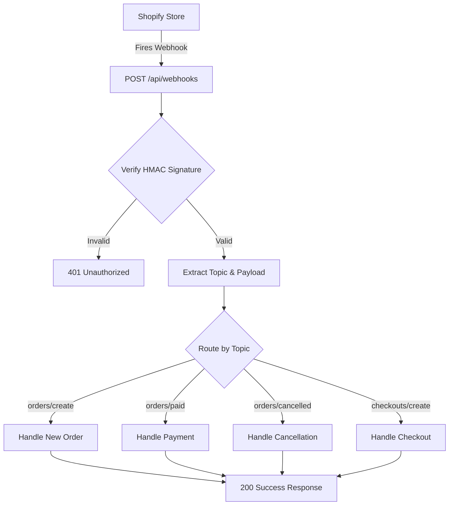

# Shopify Webhook Handler


A production-ready Node.js server that receives, verifies, and processes Shopify webhooks in real time. Built for stores that need reliable order confirmation, payment status sync, and event-driven automation without third party app overhead.

---

## The Problem This Solves

Most Shopify stores handle webhooks poorly. Unverified endpoints, no signature checking, no error handling. One bad actor spoofing a payload and your order logic fires on fake data. This handler eliminates that entirely.

---

## Architecture



---

## Supported Webhook Events

| Topic | Description |
|---|---|
| orders/create | Fires when a new order is placed |
| orders/paid | Fires when payment is confirmed |
| orders/cancelled | Fires when an order is cancelled |
| checkouts/create | Fires when a checkout session starts |

---

## Sample Webhook Payload

**Incoming Request:**
```json
{
  "headers": {
    "x-shopify-topic": "orders/paid",
    "x-shopify-hmac-sha256": "base64_encoded_signature"
  },
  "body": {
    "order_number": 1234,
    "email": "customer@example.com",
    "total_price": "149.99",
    "currency": "USD",
    "financial_status": "paid"
  }
}
```

**Server Response:**
```json
{
  "success": true,
  "message": "Webhook processed: orders/paid"
}
```

---

## Quick Start

```bash
git clone https://github.com/Waynelynx12/shopify-webhook-handler.git
cd shopify-webhook-handler
npm install
cp .env.example .env
npm run dev
```

---

## Environment Variables

| Variable | Description |
|---|---|
| SHOPIFY_WEBHOOK_SECRET | Found in Shopify Admin > Settings > Notifications |
| PORT | Server port, defaults to 3000 |
| SHOPIFY_ACCESS_TOKEN | Your store access token |

---

## Health Check

Once running, hit this endpoint to confirm the server is live:

```
GET http://localhost:3000/health
```

```json
{
  "status": "online",
  "service": "Shopify Webhook Handler",
  "timestamp": "2026-05-30T14:00:00.000Z"
}
```

---

## Built By

Sheriff Wayne, Growth Engineer and Shopify Technical Specialist. I build native code solutions for ecommerce stores that need reliability without app dependency.
